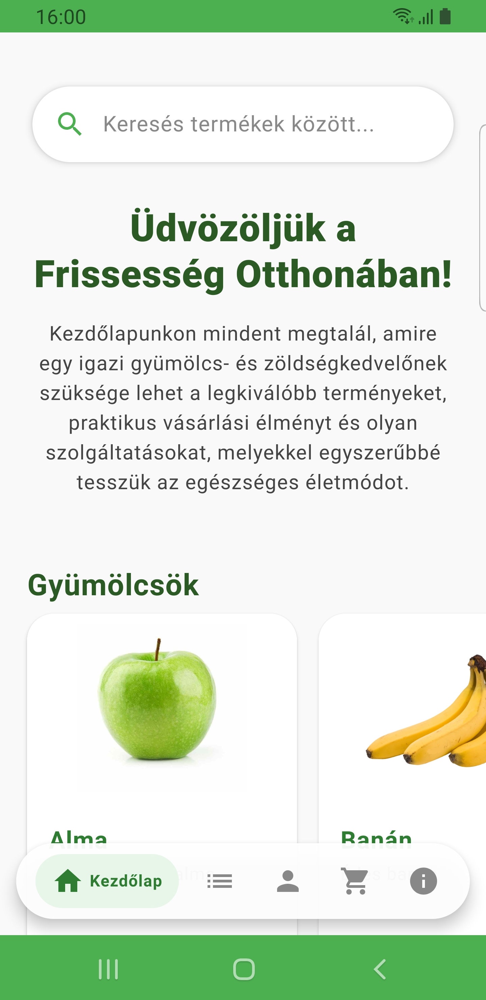
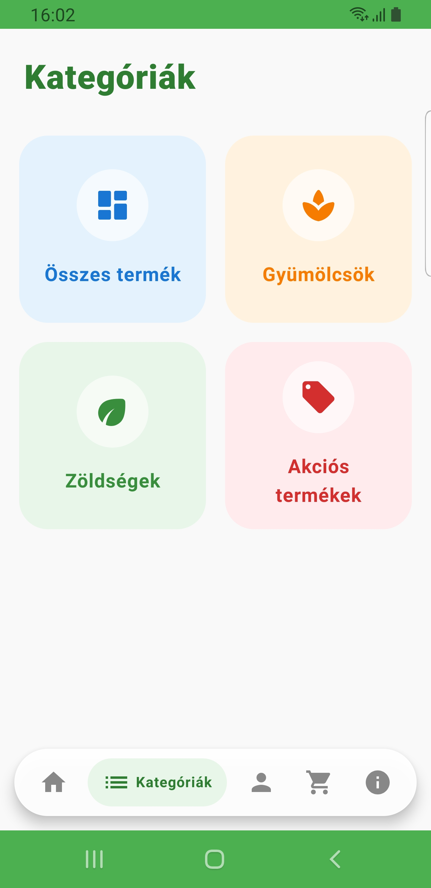
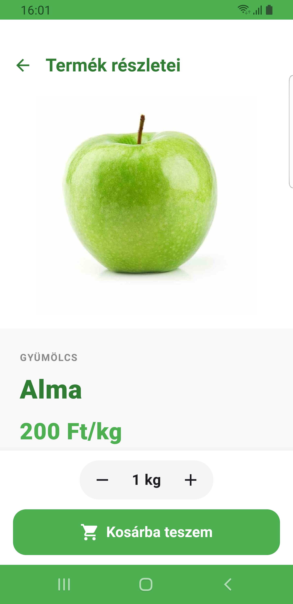
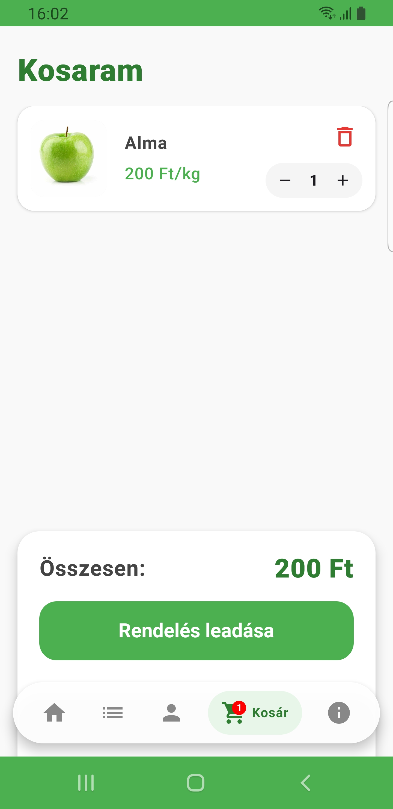
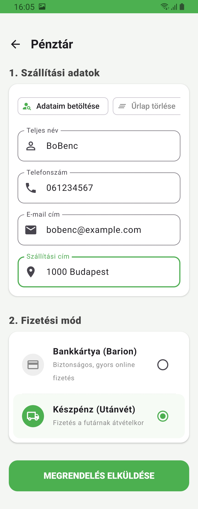

# 🍏 GyümiZöli Applikáció - Frissesség az otthonodba! 🫑

A **GyümiZöli** applikáció egy modern Android webshop alkalmazás, amely friss termelői zöldségek és gyümölcsök kényelmes megvásárlását teszi lehetővé.

## 📱 Főbb funkciók

* **Termékek böngészése:** Külön kategóriák a friss gyümölcsöknek, zöldségeknek és az aktuális akcióknak.
* **Kosár kezelés:** Termékek hozzáadása, mennyiség módosítása, dinamikus árszámítás (akciós árak kezelése), Barion fizetés.
* **Profil kezelés:** Felhasználói adatok kezelése (Bejelentkezés/Kijelentkezés, rendelések megtekintése stb.).
* **Pull-to-Refresh:** Modern, lehúzással történő azonnali adatfrissítés a Főoldalon.
* **Reszponzív UI:** Az alkalmazás használható álló és fekvő nézetben is, üveg hatású navigációs sáv a jobb felhasználói élményért.

## 🛠️ Használt Technológiák

Az alkalmazás **Kotlin** nyelven íródott és a következő Android technológiákra épül:

* **Felhasználói felület (UI):** [Jetpack Compose](https://developer.android.com/develop/ui/compose/tutorial) & Material Design 3
* **Architektúra:** MVVM (Model-View-ViewModel)
* **Függőség-injektálás (DI):** [Dagger Hilt](https://dagger.dev/hilt/)
* **Képbetöltés:** [Coil](https://coil-kt.github.io/coil/)
* **Hálózatkezelés:** [Retrofit](https://square.github.io/retrofit/download/) (kapcsolat a Laravel alapú backend API-val)
* **Bankkártyás fizetés:** [Barion](https://github.com/barion/barion-android)

## ⚙️ Beállítás

Ahhoz, hogy a projektet a saját gépeden és telefonodon is futtatni tudd, kövesd az alábbi lépéseket:

### 1. **Klónozd a tárolókat**

#### GyümiZöliWebshop
```cmd
git clone https://github.com/gyumizoli/GyumiZoliWebshop.git
```
#### GyümiZöliApp
``` cmd
git clone https://github.com/BoBenc/GyumiZoliApp.git
```
### 2. **Backend beállítása**
* Telepítsd a [Composer](https://getcomposer.org/download/) csomagkezelőt, ha még nincs telepítve.
* Telepítsd a [XAMPP](https://www.apachefriends.org/index.html) szervert (*lehet más is*) és indítsd el az Apache és MySQL szolgáltatásokat.
* Nyisd meg a *GyumiZoli_Backend* könyvtárat.
* Telepítsd a szükséges PHP csomagokat a Composer segítségével:
```cmd
composer install
```
* `.env.example` fájlból készíts egy `.env` fájlt és állítsd be az adatbázis kapcsolati adatokat.
* Generálj kulcsot a Laravel-hez:
```cmd
php artisan key:generate
```
* Futtasd a migrációkat:
```cmd
php artisan migrate
```
* Állítsd be a képek tárolását
```cmd
php artisan storage:link
```
* Indítsd el a Laravel szervert az alábbi paranccsal:
```cmd
php artisan serve --host=192.x.x.x --port=8000
```
### 3. **Android alkalmazás beállítása**
* Nyisd meg a GyümiZöliApp könyvtárat az Android Studio-ban.
* Győződj meg róla, hogy a `BASE_URL` változó a `Constants.kt` fájlban a helyi Laravel szervered URL-jére van állítva.
* Csatlakoztasd az Android eszközödet vagy indíts el egy emulátort, majd futtasd az alkalmazást.
* Az alkalmazás most már képes lesz kommunikálni a helyi Laravel backenddel, és használhatod a webshop funkcióit!

## 📸 Képernyőképek
<div align="center">

### Főoldal

</div>
<hr>

<div align="center">

### Kategóriák

</div>
<hr>

<div align="center">

### Termék részletek

</div>
<hr>

<div align="center">

### Bejelentkezés

</div>
<hr>

<div align="center">

### Kosár

</div>
<hr>

<div align="center">

### Pénztár

</div>

## ©️ Szerzői jogok
Megtalálható a LICENSE fájlban.